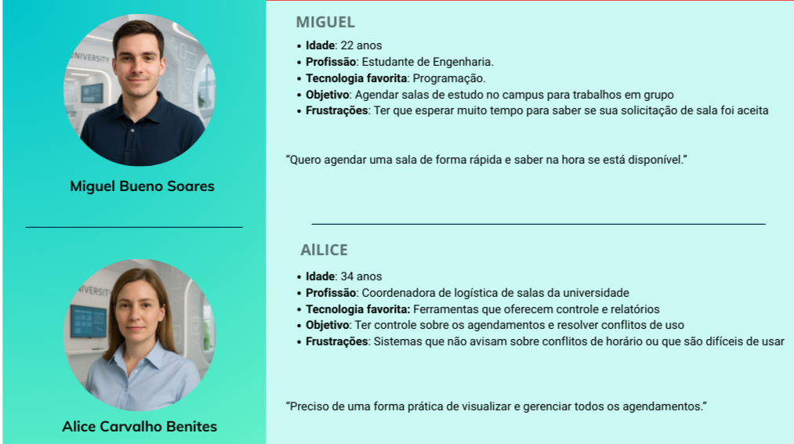
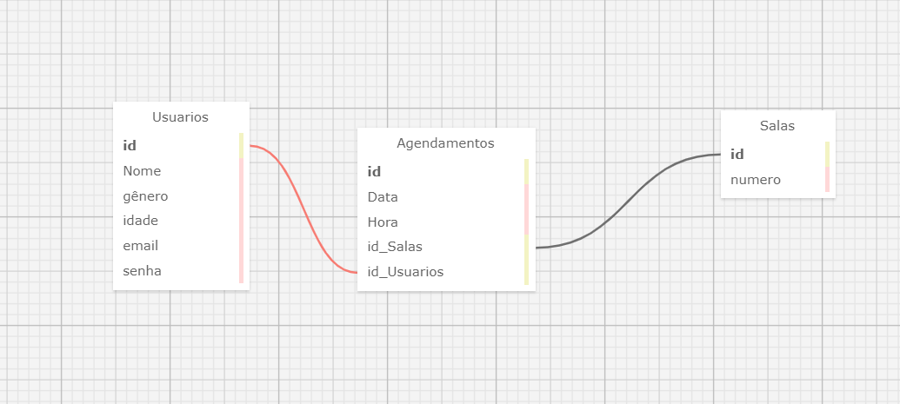
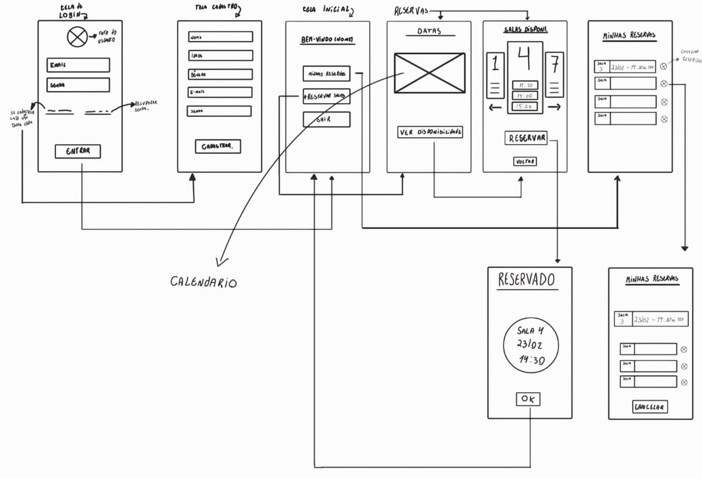
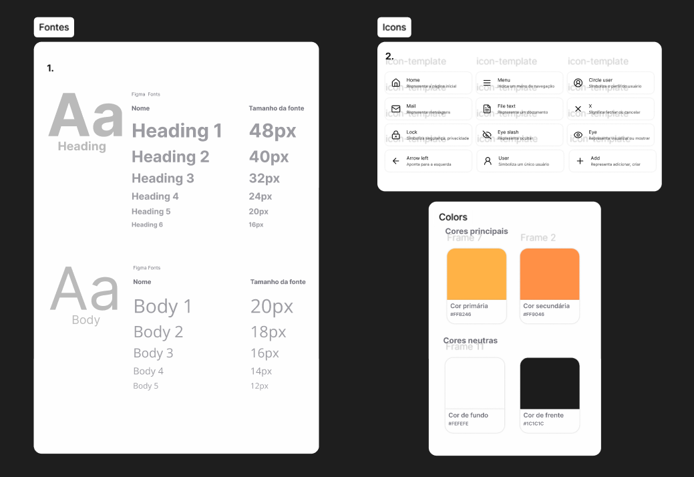
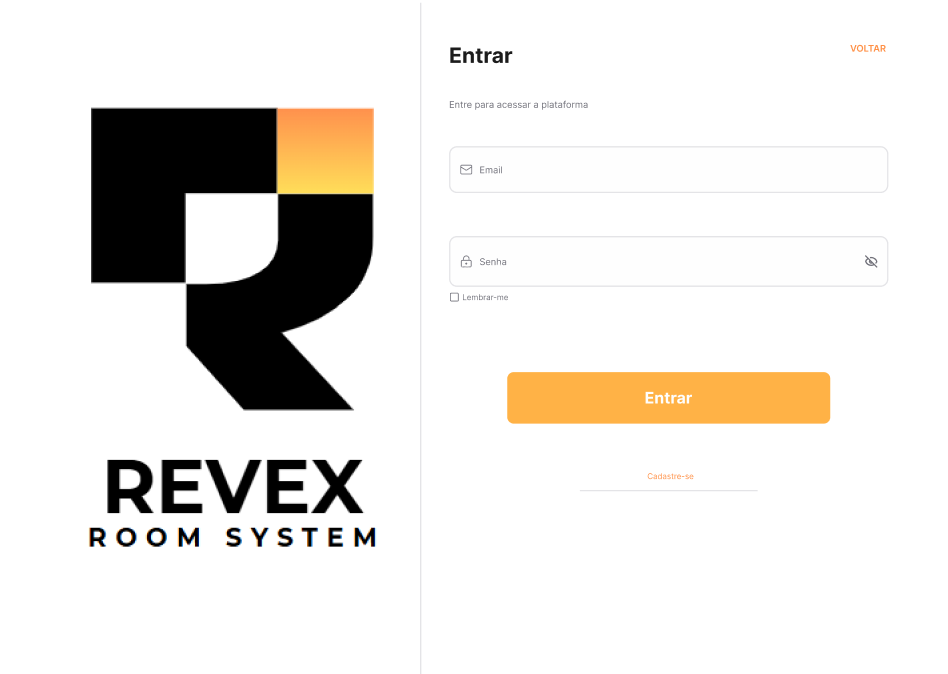
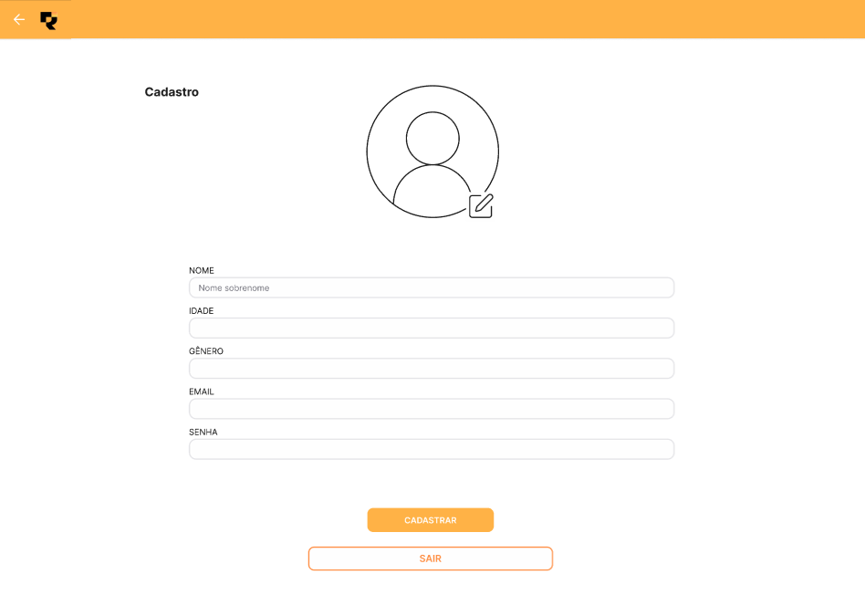
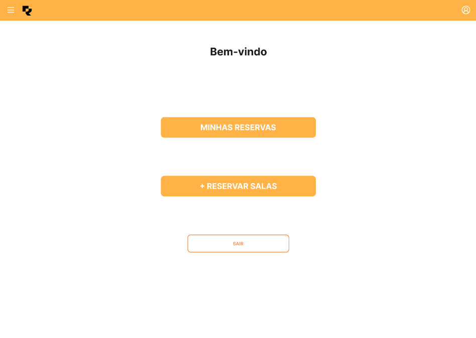
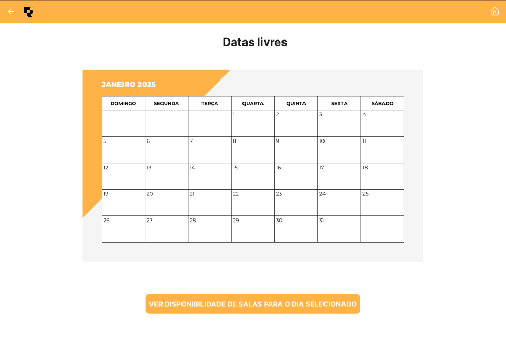
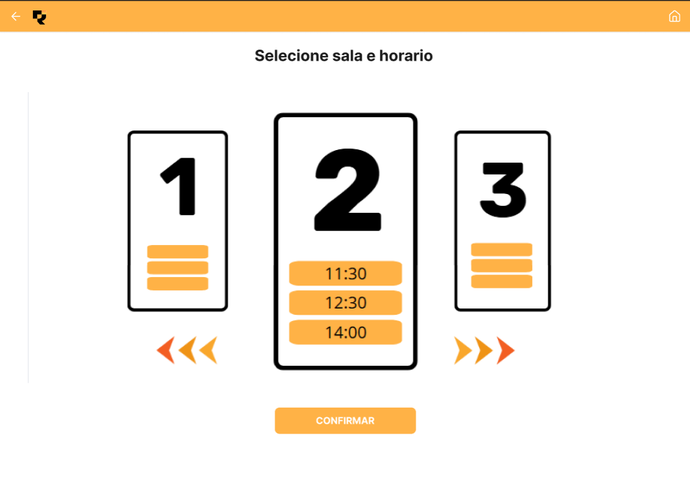
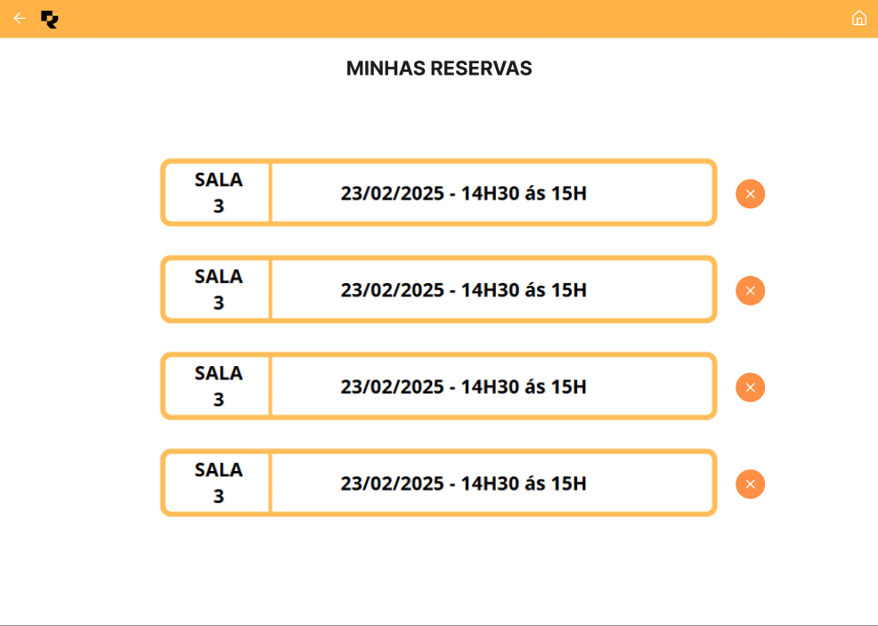

# Web Application Document - Projeto Individual - Módulo 2 - Inteli

## Sistema de reserva de salas para agendamentos.

#### Vitor Ribeiro De Mattos Silva

## Sumário

1. [Introdução](#c1)  
2. [Visão Geral da Aplicação Web](#c2)  
3. [Projeto Técnico da Aplicação Web](#c3)  
4. [Desenvolvimento da Aplicação Web](#c4)  
5. [Referências](#c5)  

<br>

## <a name="c1"></a>1. Introdução (Semana 01)

&emsp;O sistema que será desenvolvido é uma aplicação de agendamento de salas, voltada para ambientes como escritórios, coworkings, instituições de ensino ou espaços compartilhados. O objetivo principal é permitir que usuários registrados possam reservar salas disponíveis para uso em horários específicos, promovendo organização, praticidade e melhor utilização dos espaços físicos.

&emsp;A base de dados é composta por três tabelas principais: Usuarios, Agendamentos e Salas. A tabela Usuarios armazena informações pessoais como nome, gênero, idade, e-mail e senha, sendo identificada pelo campo id. A tabela Salas contém os dados das salas disponíveis, identificadas pelo número e um id único. Já a tabela Agendamentos faz a ligação entre usuários e salas, registrando a data e hora do agendamento, além dos respectivos id_usuarios e id_salas envolvidos.

&emsp;Esse sistema permite ao usuário consultar a disponibilidade das salas, selecionar o horário desejado e confirmar a reserva. Além disso, é possível aplicar autenticação para garantir que apenas usuários cadastrados realizem agendamentos. O relacionamento entre as tabelas é feito por meio de chaves estrangeiras, o que garante a integridade referencial dos dados.

---

## <a name="c2"></a>2. Visão Geral da Aplicação Web

### 2.1. Personas (Semana 01)


<div align="center">
<sub>Figura 1 - Personas - Projeto individual_M2</sub>

<sup>Fonte: Aluno Vitor Ribeiro, Faculdade Inteli 2025</sup>
</div>
---

### 👤 Miguel Bueno Soares


- **Idade:** 22 anos  
- **Profissão:** Estudante de Engenharia  
- **Tecnologia favorita:** Programação  
- **Objetivo:** Agendar salas de estudo no campus para trabalhos em grupo  
- **Frustrações:** Ter que esperar muito tempo para saber se sua solicitação de sala foi aceita  
- **Frase:**  
  > "Quero agendar uma sala de forma rápida e saber na hora se está disponível."

---

### 👤 Alice Carvalho Benites


- **Idade:** 34 anos  
- **Profissão:** Coordenadora de logística de salas da universidade  
- **Tecnologia favorita:** Ferramentas que oferecem controle e relatórios  
- **Objetivo:** Ter controle sobre os agendamentos e resolver conflitos de uso  
- **Frustrações:** Sistemas que não avisam sobre conflitos de horário ou que são difíceis de usar  
- **Frase:**  
  > "Preciso de uma forma prática de visualizar e gerenciar todos os agendamentos."

### 2.2. User Stories (Semana 01)
---
 ### Abaixo, encontram-se as User Stories mapeadas para o projeto de sistema de agendamento de salas:

US01 – Como Miguel, quero me cadastrar no sistema para poder realizar agendamentos de sala.

US02 – Como Miguel, quero fazer login com meu e-mail e senha para acessar minha conta de forma segura.

US03 – Como Miguel, quero visualizar as salas disponíveis para escolher a melhor opção para meu grupo.

US04 – Como Miguel, quero agendar uma sala com data e hora para reservar meu espaço de estudo.

US05 – Como Miguel, quero receber uma confirmação do meu agendamento para saber que ele foi registrado.

US06 – Como Miguel, quero visualizar meus agendamentos anteriores para planejar melhor meu tempo.

US07 – Como Alice, quero acessar uma lista de todos os agendamentos para monitorar a ocupação das salas.

US08 – Como Alice, quero visualizar os horários de cada sala para evitar conflitos de agendamento.

US09 – Como Alice, quero editar ou remover agendamentos caso haja erros ou conflitos.

US10 – Como Alice, quero gerar relatórios mensais sobre a utilização das salas para auxiliar na gestão acadêmica.

---

### Análise INVEST – US04 (User Story Prioritária)

US04 – Como Miguel, quero agendar uma sala com data e hora para reservar meu espaço de estudo.
--- 

### Explicação do modelo INVEST:

I – Independente:
Pode ser desenvolvida isoladamente sem dependência direta das demais funcionalidades.

N – Negociável:
Os critérios de data e hora podem ser discutidos e ajustados com base nas regras de negócio ou validações da equipe técnica.

V – Valiosa:
É uma das funcionalidades centrais do sistema, pois permite ao usuário cumprir o objetivo principal: reservar salas.

E – Estimável:
Pode ser facilmente estimada em termos de esforço de desenvolvimento, pois envolve interações comuns como CRUD com data/hora.

S – Small (Pequena):
A funcionalidade pode ser implementada em poucos dias de desenvolvimento, sendo de escopo bem definido.

T – Testável:
Pode ser testada manualmente e por testes automatizados com critérios claros, como verificar se um agendamento foi salvo com sucesso.

---

## <a name="c3"></a>3. Projeto da Aplicação Web

### 3.1. Modelagem do banco de dados  (Semana 3)
<div align="center">
<sub>Figura 2 - Diagramas de modelo relacional do banco de dados - Projeto individual_M2</sub>

<sup>Fonte: Aluno Vitor Ribeiro, Faculdade Inteli 2025</sup>
</div>


---
&emsp; A imagem acima apresenta o diagrama relacional do banco de dados do sistema de agendamento de salas. O modelo é composto por três entidades principais: Usuarios, Agendamentos e Salas, todas inter-relacionadas por meio de chaves primárias e estrangeiras que garantem a integridade dos dados.

***Esquema das Tabelas:***

### Usuarios

id (PK): Identificador único do usuário.

1. **Nome:** Nome do usuário.

2. **gênero:** Gênero do usuário.

3. **idade:** Idade do usuário.

4. **email:** E-mail do usuário.

5. **senha:** Senha para autenticação no sistema.

### Agendamentos

id (PK): Identificador único do agendamento.

1. **Data:** Data em que a sala será utilizada.

2. **Hora:** Hora do agendamento.

3. **id_Salas (FK):** Referência ao id da tabela Salas.

4. **id_Usuarios (FK):** Referência ao id da tabela Usuarios.

### Salas

id (PK): Identificador único da sala.

1. **numero:** Número de identificação da sala.
---


 **Relações:**
A tabela Agendamentos funciona como uma tabela de junção entre Usuarios e Salas, representando a reserva de uma sala por um determinado usuário em uma data e hora específicos.

A coluna id_Usuarios na tabela Agendamentos é uma chave estrangeira que se relaciona com a chave primária id da tabela Usuarios.

Da mesma forma, id_Salas é uma chave estrangeira que se relaciona com o id da tabela Salas.

---

### Modelo físico (arquivo .sql)

``` -- init.sql

-- Criar extensão para suportar UUIDs, se ainda não estiver ativada
CREATE EXTENSION IF NOT EXISTS "uuid-ossp";

-- Criar tabela de usuários
CREATE TABLE IF NOT EXISTS usuarios (
    id UUID PRIMARY KEY DEFAULT uuid_generate_v4(),
    nome VARCHAR(100) NOT NULL,
    genero VARCHAR(20),
    idade INTEGER,
    email VARCHAR(100) UNIQUE NOT NULL,
    senha VARCHAR(100) NOT NULL,
    created_at TIMESTAMP DEFAULT CURRENT_TIMESTAMP
);

-- Criar tabela de salas
CREATE TABLE IF NOT EXISTS salas (
    id UUID PRIMARY KEY DEFAULT uuid_generate_v4(),
    numero VARCHAR(20) NOT NULL UNIQUE,
    capacidade INTEGER,
    descricao TEXT,
    status VARCHAR(20) DEFAULT 'disponivel',
    created_at TIMESTAMP DEFAULT CURRENT_TIMESTAMP
);

-- Criar tabela de agendamentos
CREATE TABLE IF NOT EXISTS agendamentos (
    id UUID PRIMARY KEY DEFAULT uuid_generate_v4(),
    data DATE NOT NULL,
    hora TIME NOT NULL,
    id_usuario UUID NOT NULL,
    id_sala UUID NOT NULL,
    status VARCHAR(20) DEFAULT 'confirmado',
    created_at TIMESTAMP DEFAULT CURRENT_TIMESTAMP,
    CONSTRAINT fk_usuario FOREIGN KEY (id_usuario) REFERENCES usuarios(id) ON DELETE CASCADE,
    CONSTRAINT fk_sala FOREIGN KEY (id_sala) REFERENCES salas(id) ON DELETE CASCADE,
    CONSTRAINT unique_sala_data_hora UNIQUE (id_sala, data, hora)
);

-- Inserir dados de teste na tabela de usuários
INSERT INTO usuarios (nome, genero, idade, email, senha)
VALUES 
    ('Miguel Bueno Soares', 'Masculino', 22, 'miguel.soares@email.com', 'senha123'),
    ('Alice Smith', 'Feminino', 25, 'alice.smith@email.com', 'senha456'),
    ('Carol Williams', 'Feminino', 28, 'carol.williams@email.com', 'senha789');

-- Inserir dados de teste na tabela de salas
INSERT INTO salas (numero, capacidade, descricao)
VALUES 
    ('101', 6, 'Sala de estudo pequena - 1º andar'),
    ('102', 8, 'Sala de estudo média - 1º andar'),
    ('201', 12, 'Sala de reunião grande - 2º andar'),
    ('202', 4, 'Sala de estudo individual - 2º andar');

-- Inserir dados de teste na tabela de agendamentos
INSERT INTO agendamentos (data, hora, id_usuario, id_sala)
VALUES 
    (CURRENT_DATE, '09:00:00', (SELECT id FROM usuarios WHERE email = 'miguel.soares@email.com'), (SELECT id FROM salas WHERE numero = '101')),
    (CURRENT_DATE, '14:00:00', (SELECT id FROM usuarios WHERE email = 'alice.smith@email.com'), (SELECT id FROM salas WHERE numero = '201'));


```

---

### 3.1.1 BD e Models (Semana 5)

**modelAgendamento**: O `AgendamentoModel` é responsável por gerenciar as operações de CRUD dos agendamentos no banco de dados PostgreSQL, incluindo criação, consulta (por ID, por usuário ou todos), atualização e exclusão. Ele também realiza consultas que juntam dados de usuários e salas para fornecer informações completas, além de verificar conflitos de horário para evitar sobreposições em uma mesma sala, garantindo assim a integridade dos agendamentos no sistema.

**modelSala**: O `SalaModel` gerencia as operações de CRUD para as salas no banco de dados PostgreSQL, permitindo criar, consultar (por ID, número ou todos), atualizar e excluir registros de salas. Além disso, inclui um método para verificar a disponibilidade da sala em determinada data e hora, consultando os agendamentos confirmados para evitar conflitos, garantindo o controle eficaz das salas no sistema.

**userModel**: O `UserModel` gerencia as operações de CRUD para os usuários no banco de dados PostgreSQL, incluindo criação, consulta (por ID, email ou todos), atualização e exclusão de registros. Ele manipula dados essenciais como nome, gênero, idade, email e senha, garantindo o gerenciamento eficiente das informações dos usuários no sistema.


### 3.2. Arquitetura (Semana 5)

*Posicione aqui o diagrama de arquitetura da sua solução de aplicação web. Atualize sempre que necessário.*

**Instruções para criação do diagrama de arquitetura**  
- **Model**: A camada que lida com a lógica de negócios e interage com o banco de dados.
- **View**: A camada responsável pela interface de usuário.
- **Controller**: A camada que recebe as requisições, processa as ações e atualiza o modelo e a visualização.
  
*Adicione as setas e explicações sobre como os dados fluem entre o Model, Controller e View.*

### 3.3. Wireframes (Semana 03)

<div align="center">
<sub>Figura 3 - Diagramas de modelo relacional do banco de dados - Projeto individual_M2</sub>

<sup>Fonte: Aluno Vitor Ribeiro, Faculdade Inteli 2025</sup>
</div>

### 3.4. Guia de estilos (Semana 05)

<div align="center">
<sub>Figura 4 - Guia de estilos - Projeto individual_M2</sub>

<sup>Fonte: Aluno Vitor Ribeiro, Faculdade Inteli 2025</sup>
</div>

#  Aplicação do Guia de Estilos – REVEX Room System

Este documento descreve como os componentes do guia de estilos foram utilizados na interface da aplicação REVEX, promovendo consistência visual e usabilidade.

---

## 1. Tipografia

A hierarquia tipográfica foi respeitada em toda a aplicação:

- **Headings**:
  - Utilizados em telas como:
  - **Frame 3 (Bem-vindo)** e **Frame 6 (Minhas Reservas)** com títulos evidentes e centralizados.
  - Fonte de título legível e em destaque (provavelmente `Heading 1` ou `Heading 2`).

- **Body Text**:
  - Utilizado em campos de formulários (Frame 1 e 2), botões e descrições de horários e datas.
  - Tamanhos menores (como `Body 2` ou `Body 3`) são aplicados para textos explicativos e dados menos destacados.

---

## 2. Ícones

Ícones são aplicados de forma funcional e intuitiva:

- Ícone de menu lateral e ícone de perfil aparecem na barra superior de navegação (presentes em todos os frames exceto o de login).
- Ícones de ação como o botão **“+”** ou **“lixeira”** no Frame 6 servem para adicionar ou remover reservas.
- Ícones de setas (Frame 5) são utilizados para navegação entre salas e horários disponíveis.

> O uso consistente dos ícones melhora a experiência do usuário, reforçando as funções dos elementos visuais.

---

## 3. Cores

A paleta de cores definida no guia foi aplicada com clareza:

### Cores principais:
- **#FFB246 (primária)** e **#FF9046 (secundária)** aparecem:
  - Em **botões** (como “Entrar”, “Confirmar”, “Cadastrar”).
  - Na **barra de navegação superior**.
  - Como destaque visual em elementos de interação (setas, ícones e seletores de sala).

### Cores neutras:
- **#FEFEFE (fundo)**: Fundo claro em todas as telas, promovendo clareza e contraste.
- **#1C1C1C (texto)**: Usado para garantir legibilidade em botões, rótulos de campos, títulos e textos de horários.

---

## 4. Layout e Navegação

A aplicação segue um layout centralizado e organizado, com boa separação de seções e uso adequado do espaçamento. A navegação é simples, com passos lógicos:
1. **Login (Frame 1)**
2. **Cadastro (Frame 2)**
3. **Tela de boas-vindas e opções (Frame 3)**
4. **Seleção de data (Frame 4)**
5. **Seleção de sala e horário (Frame 5)**
6. **Visualização e gerenciamento de reservas (Frame 6)**

---

### 3.5. Protótipo de alta fidelidade (Semana 05)

# REVEX Room System – Telas da Aplicação

A seguir está a descrição das telas principais do sistema **REVEX Room System**, uma aplicação voltada para a reserva de salas.

---

##  Frame 1 – Tela de Login

link de acesso ao igma: [Protótipo auta fidelidade - figma]( https://www.figma.com/design/1AmZBZkzc4asEOjEZ8Mb5o/REVEX?node-id=28-2&t=rIC7iE7UDH9wUiZN-1)

<div align="center">
<sub>Figura 5 - Guia de estilos - Projeto individual_M2</sub>

<sup>Fonte: Aluno Vitor Ribeiro, Faculdade Inteli 2025</sup>
</div>

- Exibe o logotipo da aplicação.
- Campos de entrada:
  - **E-mail**
  - **Senha**
- Opções:
  - [ ] **Manter-me logado**
  - 🔘 **Entrar**
  - 🔗 **Cadastrar-se** (link para a tela de registro)

---

##  Frame 2 – Tela de Cadastro

<div align="center">
<sub>Figura 6 - Guia de estilos - Projeto individual_M2</sub>

<sup>Fonte: Aluno Vitor Ribeiro, Faculdade Inteli 2025</sup>
</div>

- Ícone ilustrativo de usuário (avatar).
- Formulário com os seguintes campos:
  - **Nome**
  - **Telefone**
  - **E-mail**
  - **Matrícula**
  - **Senha**
- Botões:
  -  **Cadastrar-se**
  -  **Voltar** (retorna à tela de login)

---

##  Frame 3 – Tela Inicial após Login

<div align="center">
<sub>Figura 7 - Guia de estilos - Projeto individual_M2</sub>

<sup>Fonte: Aluno Vitor Ribeiro, Faculdade Inteli 2025</sup>
</div>

- Saudação de **boas-vindas** ao usuário.
- Ações disponíveis:
  -  **Minhas Reservas**
  -  **+ Reservar Salas**
  -  **Sair**

---

##  Frame 7 – Seleção de Datas Disponíveis

<div align="center">
<sub>Figura 8 - Guia de estilos - Projeto individual_M2</sub>

<sup>Fonte: Aluno Vitor Ribeiro, Faculdade Inteli 2025</sup>
</div>

- Exibe um **calendário mensal** (exemplo: Janeiro 2025).
- Permite selecionar um dia para reserva.
- Botão:
  -  **Ver disponibilidade de salas para o dia selecionado**

---

##  Frame 5 – Seleção de Sala e Horário

<div align="center">
<sub>Figura 9 - Guia de estilos - Projeto individual_M2</sub>

<sup>Fonte: Aluno Vitor Ribeiro, Faculdade Inteli 2025</sup>
</div>

- Interface de **carrossel** com as salas disponíveis (ex: Sala 1, 2, 3).
- Exibição de horários disponíveis:
  - **11:30**
  - **12:30**
  - **14:00**
- Controles de navegação:
  -  para navegar entre as salas
- Botão:
  -  **Confirmar**

---

##  Frame 6 – Tela de Minhas Reservas

<div align="center">
<sub>Figura 10 - Guia de estilos - Projeto individual_M2</sub>

<sup>Fonte: Aluno Vitor Ribeiro, Faculdade Inteli 2025</sup>
</div>

- Lista das reservas realizadas pelo usuário.
- Cada item exibe:
  - **Nome da sala**
  - **Data e horário da reserva** (ex: `23/02/2025 – 14h30 às 15h`)
- Ícone de (X) para **exclusão** da reserva

---

 


### 3.6. WebAPI e endpoints (Semana 05)

*Utilize um link para outra página de documentação contendo a descrição completa de cada endpoint. Ou descreva aqui cada endpoint criado para seu sistema.*  

### 3.7 Interface e Navegação (Semana 07)

*Descreva e ilustre aqui o desenvolvimento do frontend do sistema web, explicando brevemente o que foi entregue em termos de código e sistema. Utilize prints de tela para ilustrar.*

---

## <a name="c4"></a>4. Desenvolvimento da Aplicação Web (Semana 8)

### 4.1 Demonstração do Sistema Web (Semana 8)

*VIDEO: Insira o link do vídeo demonstrativo nesta seção*
*Descreva e ilustre aqui o desenvolvimento do sistema web completo, explicando brevemente o que foi entregue em termos de código e sistema. Utilize prints de tela para ilustrar.*

### 4.2 Conclusões e Trabalhos Futuros (Semana 8)

*Indique pontos fortes e pontos a melhorar de maneira geral.*
*Relacione também quaisquer outras ideias que você tenha para melhorias futuras.*


## <a name="c5"></a>5. Referências

_Incluir as principais referências de seu projeto, para que seu parceiro possa consultar caso ele se interessar em aprofundar. Um exemplo de referência de livro e de site:_<br>

---
---
